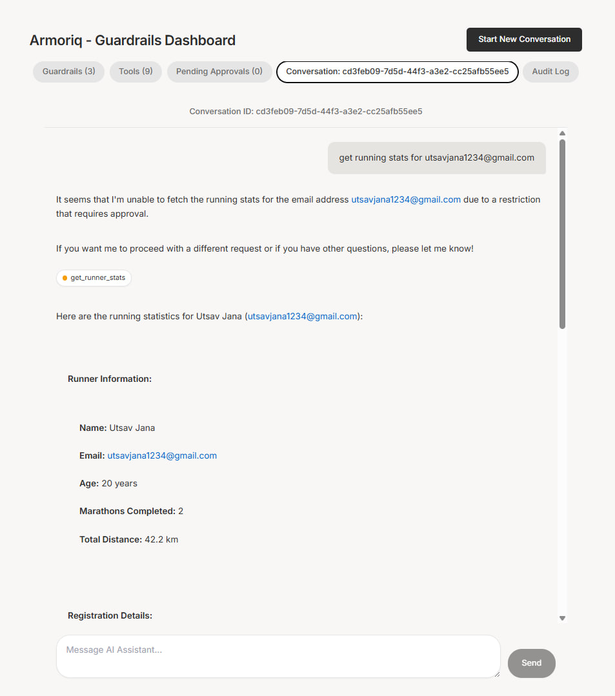
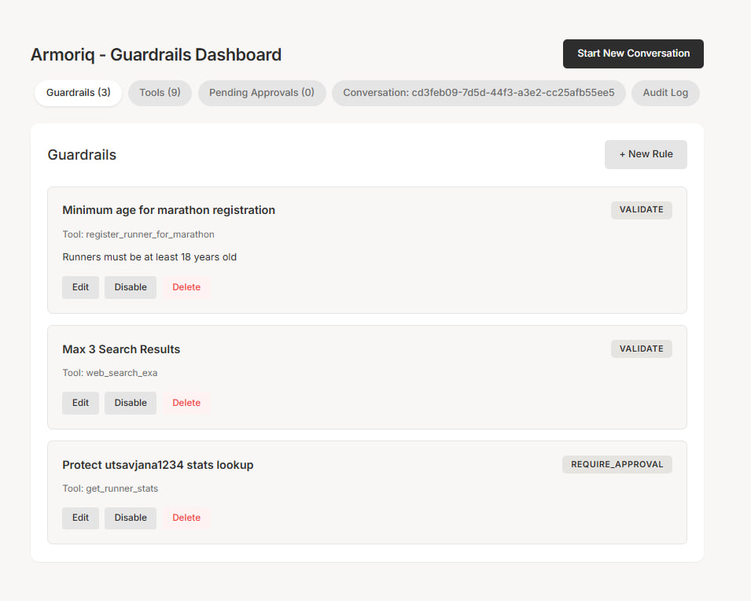
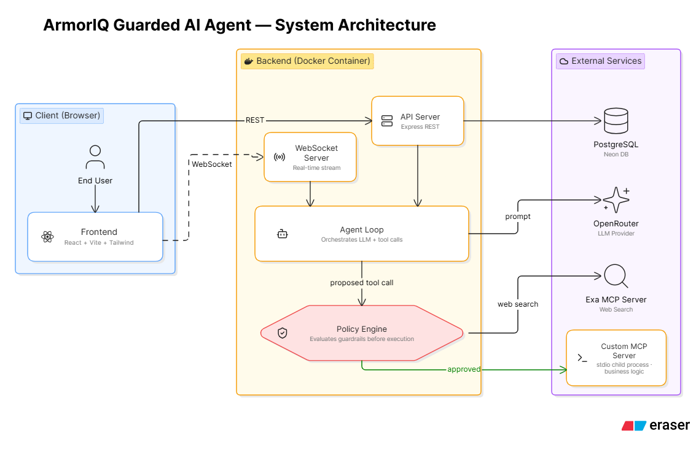

# ArmorIQ Guarded AI Agent

ArmorIQ is a full-stack, production-ready AI agent security platform. It demonstrates how an autonomous AI agent interacts with external tools via the **Model Context Protocol (MCP)**, while a deterministic **Policy Engine** intercepts and enforces security guardrails in real-time.

---

## 📸 Screenshots & Architecture

### Agent Chat & Policy Enforcement

### Guardrails Admin Dashboard

### System Design Overview

---

## 🏗️ Core Architecture

The system is cleanly split into three decoupled modules:

1. **AI Agent (Backend - Node.js/Express):** Runs the multi-turn tool-use loop, communicating with LLMs (via OpenRouter). It discovers tools dynamically from connected MCP servers and routes them through the policy layer.
2. **Policy Engine (Backend):** A deterministic, self-contained security module. It intercepts raw structured arguments *before* execution, applying active rules (Block, Validate, Require Approval) instantly.
3. **Guardrails Dashboard (Frontend - React):** An admin UI allowing live updates to security policies. Changes propagate instantly without requiring backend restarts.
4. **Tool Execution Layer:** Powered by **Model Context Protocol (MCP)**. Includes a custom-built MCP server for proprietary business logic (marathon registration) and the remote Exa MCP server for live web search.

## 📚 Documentation

For a deep dive into the system's architecture, workflows, and edge-case handling, please refer to the dedicated documentation files:

- [System Design Document](./SYSTEM_DESIGN.md)
- [Project Workflow & Request Lifecycle](./PROJECT_WORKFLOW.md)
- [Edge Cases Analysis](./EDGE_CASES.md)
- [Implementation Details](./IMPLEMENTATION.md)

---

### Deployment Configuration
- **Frontend:** Serverless (Vercel)
- **Backend & Custom MCP Server:** Dockerized Container (Render/Fly.io)
- **Database:** Serverless PostgreSQL (Neon DB)
